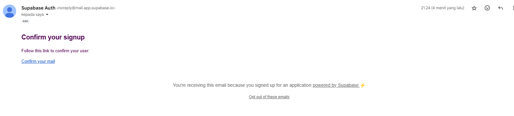
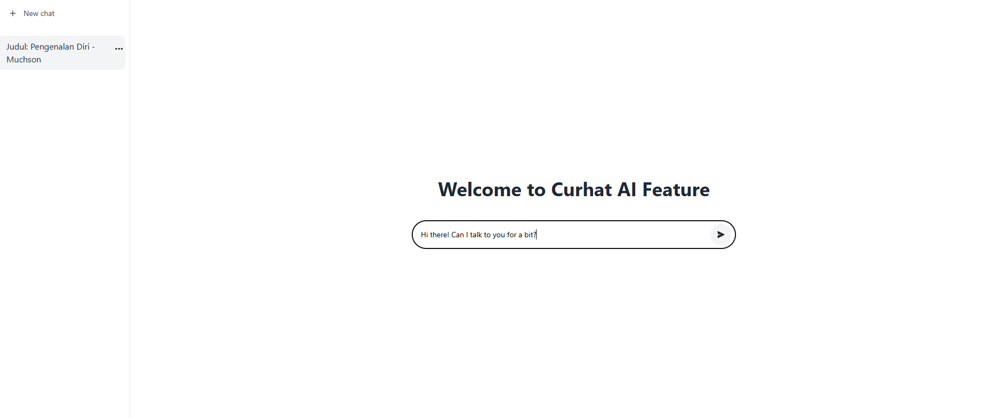
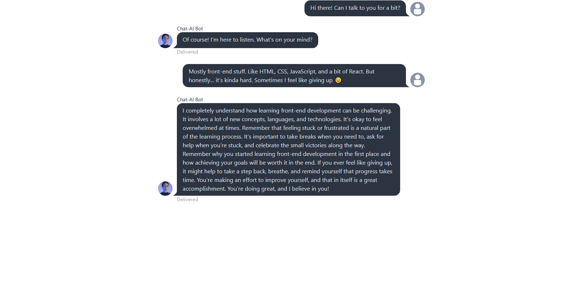

# Curhat AI

Curhat AI is a web application that uses React, Redux, and Supabase to build features such as user authentication, chat, and integration with the OpenAI API. The application also uses Tailwind CSS for styling and Vite as the build tool.

## Deployment
deployment app : https://curhat-ai.vercel.app/
## Features

- User authentication (Sign Up, Login)
- Chat with OpenAI integration
- Chat session management
- Responsive design with Tailwind CSS
## Application Feature Screenshots

Below are several screenshots of the main features in the application:

---

### 1. Landing Page  
The initial page that appears when users first open the application.


---

### 2. Register Page  
A form to sign up as a new user.



**Fitur:**
- Input nama, email, dan password
- Validasi form input
- Link ke halaman login

---

### 3. Login Page  
A form for users who already have an account.


**Features:**  
- Email and password input  
- Account validation  
- Error message on failed login  

---

### 4. Chat with AI  
The main feature for directly interacting with AI.

  
  


**Features:**  
- Ask questions via input  
- Real-time AI responses  
- Interactive conversation display  
- Supports multiple languages used in the chat  

---

### 5. AI Answer Output  
Example view of the AI-generated response.


---

### 6. Pricing  
A page that explains the pricing of the application.


**Features:**  
- Subscription pricing  
- Features included in each plan  
---
## Technologies Used

- [React](https://reactjs.org/)
- [Redux](https://redux.js.org/)
- [Supabase](https://supabase.io/)
- [OpenAI API](https://openai.com/)
- [Tailwind CSS](https://tailwindcss.com/)
- [Vite](https://vitejs.dev/)

## Installation

1. Clone this repository

    ```bash
    git clone https://github.com/username/curhat-ai.git
    cd curhat-ai
    ```

2. Install dependencies

    ```bash
    npm install
    ```

3. Create a `.env` file in the root directory and add the following environment variables:

    ```env
    VITE_SUPABASE_URL=your-supabase-url
    VITE_SUPABASE_ANON_KEY=your-supabase-anon-key
    VITE_OPENAI_API_KEY=your-openai-api-key
    ```

4. Run the application

    ```bash
    npm run dev
    ```

## Directory Structure

```plaintext
curhat-ai/
├── public/
│   ├── user_default.jpg
│   └── ...
├── src/
│   ├── features/
│   │   ├── auth/
│   │   │   ├── components/
│   │   │   │   └── RegisterForm.jsx
│   │   │   ├── hooks/
│   │   │   │   └── useRegister.jsx
│   │   │   └── services/
│   │   │       └── authService.js
│   │   ├── chat/
│   │   │   ├── components/
│   │   │   │   ├── Sidebar.jsx
│   │   │   │   └── ChatUser.jsx
│   │   │   ├── hooks/
│   │   │   │   └── useChatWithRedux.js
│   │   │   └── redux/
│   │   │       └── chatSlice.js
│   │   └── sidebar/
│   │       └── redux/
│   │           └── sidebarSlice.js
│   ├── pages/
│   │   └── Login.jsx
│   ├── App.jsx
│   ├── main.jsx
│   └── ...
├── .env
├── package.json
└── vite.config.js
