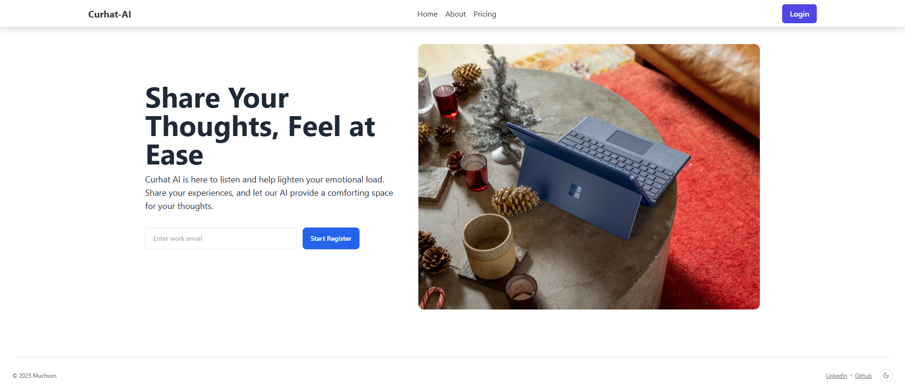
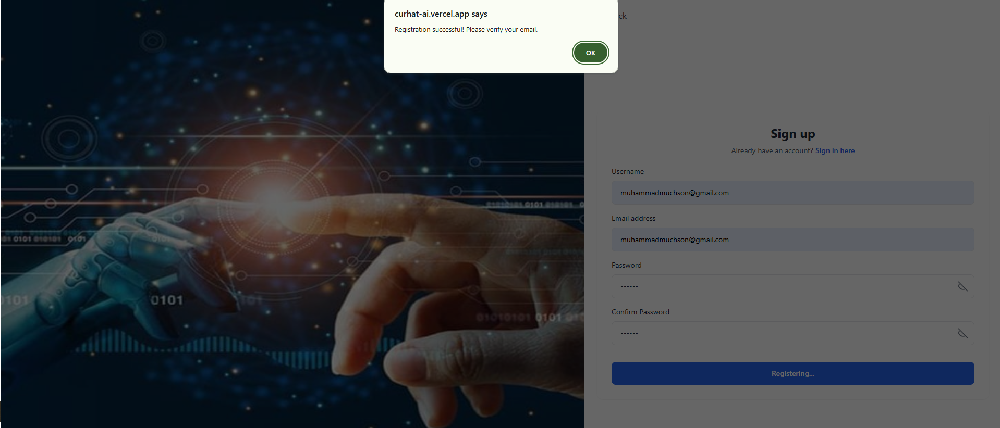
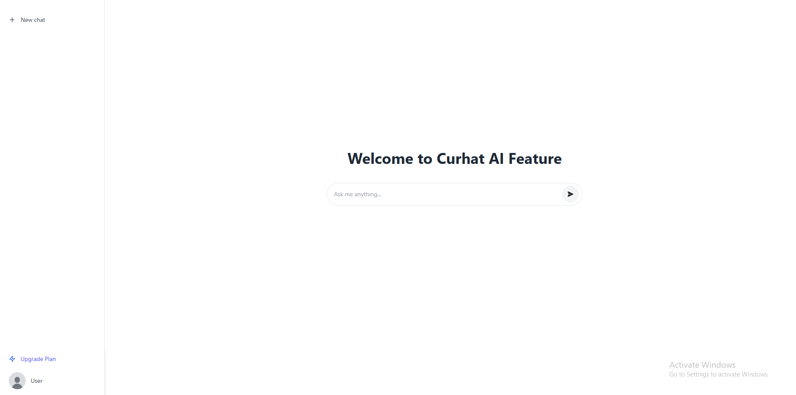
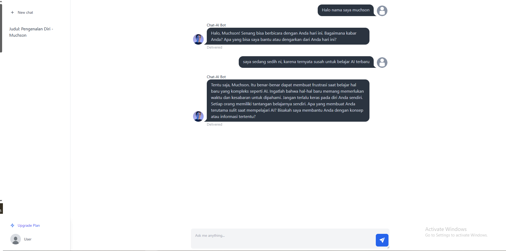
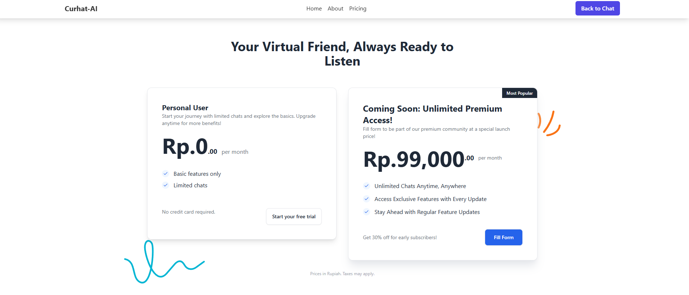

# Curhat AI

Curhat AI is a web application that uses React, Redux, and Supabase to build features such as user authentication, chat, and integration with the OpenAI API. The application also uses Tailwind CSS for styling and Vite as the build tool.

## Deployment
deployment app : https://curhat-ai.vercel.app/
## Features

- User authentication (Sign Up, Login)
- Chat with OpenAI integration
- Chat session management
- Responsive design with Tailwind CSS
## 📸 Tangkapan Layar Fitur Aplikasi

Berikut adalah beberapa tangkapan layar dari fitur-fitur utama dalam aplikasi:

---

### 1. 🏠 Landing Page
Halaman awal yang muncul ketika pengguna pertama kali membuka aplikasi.



---

### 2. 📝 Halaman Register
Formulir untuk mendaftar sebagai pengguna baru.



**Fitur:**
- Input nama, email, dan password
- Validasi form input
- Link ke halaman login

---

### 3. 🔐 Halaman Login
Formulir untuk pengguna yang sudah memiliki akun.


**Fitur:**
- Input email dan password
- Validasi akun
- Pesan error jika login gagal

---

### 4. 💬 Chat dengan AI
Fitur utama untuk berinteraksi dengan AI secara langsung.



**Fitur:**
- Input pertanyaan
- Respons real-time dari AI
- Tampilan percakapan yang interaktif

---

### 5. ✅ Hasil Jawaban AI
Contoh tampilan hasil jawaban dari AI.



---

### 6. ℹ️ Pricing
Halaman yang menjelaskan tentang harga dari aplikasi.



**Fitur:**
- Harga berlangganan
- Fitur yang didapatkan pada setiap paket
---
## Technologies Used

- [React](https://reactjs.org/)
- [Redux](https://redux.js.org/)
- [Supabase](https://supabase.io/)
- [OpenAI API](https://openai.com/)
- [Tailwind CSS](https://tailwindcss.com/)
- [Vite](https://vitejs.dev/)

## Installation

1. Clone this repository

    ```bash
    git clone https://github.com/username/curhat-ai.git
    cd curhat-ai
    ```

2. Install dependencies

    ```bash
    npm install
    ```

3. Create a `.env` file in the root directory and add the following environment variables:

    ```env
    VITE_SUPABASE_URL=your-supabase-url
    VITE_SUPABASE_ANON_KEY=your-supabase-anon-key
    VITE_OPENAI_API_KEY=your-openai-api-key
    ```

4. Run the application

    ```bash
    npm run dev
    ```

## Directory Structure

```plaintext
curhat-ai/
├── public/
│   ├── user_default.jpg
│   └── ...
├── src/
│   ├── features/
│   │   ├── auth/
│   │   │   ├── components/
│   │   │   │   └── RegisterForm.jsx
│   │   │   ├── hooks/
│   │   │   │   └── useRegister.jsx
│   │   │   └── services/
│   │   │       └── authService.js
│   │   ├── chat/
│   │   │   ├── components/
│   │   │   │   ├── Sidebar.jsx
│   │   │   │   └── ChatUser.jsx
│   │   │   ├── hooks/
│   │   │   │   └── useChatWithRedux.js
│   │   │   └── redux/
│   │   │       └── chatSlice.js
│   │   └── sidebar/
│   │       └── redux/
│   │           └── sidebarSlice.js
│   ├── pages/
│   │   └── Login.jsx
│   ├── App.jsx
│   ├── main.jsx
│   └── ...
├── .env
├── package.json
└── vite.config.js